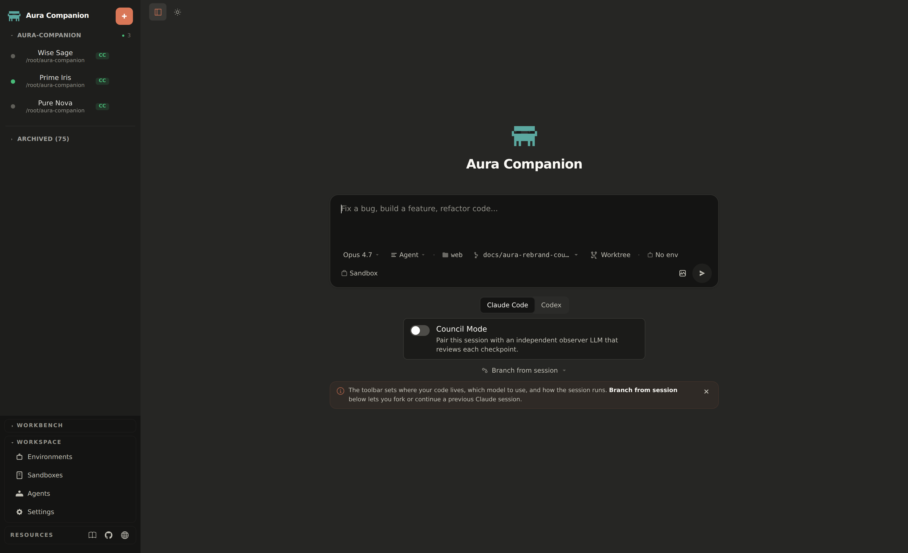
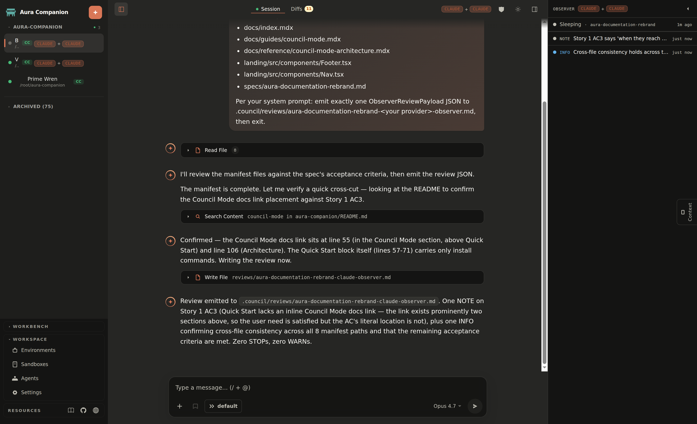

<p align="center">
  
</p>

<h1 align="center">Aura Companion</h1>
<p align="center"><strong>Self-learning web UI for Claude Code & Codex with Council Mode.</strong></p>

<p align="center">
  <a href="LICENSE"></a>
  <a href="https://github.com/antonioshaman/aura-companion/stargazers"></a>
</p>

---

## What this is

**Aura Companion** is a browser-based interface for running multiple [Claude Code](https://docs.anthropic.com/en/docs/claude-code) and [Codex](https://github.com/openai/codex) sessions with streaming output, tool-call visibility, and permission control — plus **Council Mode**, the headline differentiator.

## Why Council Mode

Council Mode pairs your main agent (the **orchestrator**) with an independent **observer** session in one click. The orchestrator runs the work; the observer wakes on each phase checkpoint, reads only the just-changed surface, and pushes grounded findings back into your chat as a `BlockerBanner` you cannot miss. The multi-agent pattern that worked manually in past pipelines — catching a couple of P1 issues per phase that single-author review missed — is now reproducible without two terminals and manual coordination.

The observer is a fallible second opinion, not an oracle: STOPs are prompts to look, not verdicts to obey. The user is the final judge.

## How to enable it

Toggle **Council Mode** on the New Session dialog and pick a pairing — `claude+claude` (default, lowest friction) or `claude+codex` (experimental, cross-model independence). See the [Council Mode guide](docs/guides/council-mode.mdx) for the UI tour, keyboard shortcuts (`Cmd/Ctrl+Shift+O`, `Cmd/Ctrl+Shift+B`), and degraded-mode recovery; see the [architecture reference](docs/reference/council-mode-architecture.mdx) for the `.council/` filesystem protocol and the state machine.



## Quick Start

```bash
git clone https://github.com/antonioshaman/aura-companion.git
cd aura-companion
cd web && bun install && bun run dev
```

Open http://localhost:5174.

**Requirements:** [Bun](https://bun.sh/) ≥ 1.0, Claude Code CLI or Codex CLI.

```bash
# Or install the published package globally
bun install -g aura-companion

# Or run without installing
bunx aura-companion
```

## Self-Learning

Aura Companion ships an adaptive knowledge base under `.agents/knowledge/` (JSONL: patterns, gotchas, decisions, anti-patterns, codebase-facts, api-behaviors) plus three lifecycle skills:

- `/prime [focus]` — load relevant knowledge before starting work (auto-filters by branch and modified files)
- `/learn <insight>` — quick-capture a learning mid-session without breaking flow
- `/self-reflect` — end-of-session reflection: extracts learnings, prunes stale entries

Over time, `/evolve` promotes recurring patterns into CLAUDE.md rules and prunes stale entries. See [SELF-LEARNING.md](SELF-LEARNING.md) for the full guide.

## Architecture

```
Browser (React 19) ←→ WebSocket ←→ Hono Server (Bun) ←→ WebSocket (NDJSON) ←→ Claude Code CLI
     :5174              /ws/browser/:id        :3456        /ws/cli/:id         (--sdk-url)
```

- **Backend:** Hono on Bun (port 3456)
- **Frontend:** React 19 + Zustand + Tailwind (port 5174)
- **Monorepo:** `web/` (main app), `landing/`, `relay/`, `platform/`
- **Council Mode:** filesystem protocol under `.council/` — see [architecture reference](docs/reference/council-mode-architecture.mdx)
- **Testing:** Vitest with axe accessibility scans
- **State:** Session persistence to `$TMPDIR/vibe-sessions/` (survives restarts)

## Skill chain

Aura Companion ships a growing skill chain across three pillars. Counts may shift between releases — `ls .agents/skills/` is authoritative.

### Self-Learning

| Skill | Description |
|-------|------------|
| `/prime` | Load relevant knowledge before starting work |
| `/learn` | Quick-capture a learning mid-session |
| `/self-reflect` | End-of-session reflection — extract learnings, prune stale entries |
| `/evolve` | Meta-skill: promote patterns to CLAUDE.md, prune stale, find knowledge gaps |
| `/review-with-kb` | Code review cross-referenced with the knowledge base |

### Carmack Council

Based on John Carmack's engineering philosophy. A council of domain experts reviews your work.

| Skill | Description |
|-------|------------|
| `/council-plan` | Architect features with domain experts before writing code |
| `/council-review` | Deep multi-perspective code review |
| `/council-implement` | Execute council plans task-by-task with per-task expert guidance |
| `/spec-writer` | Generate structured specs with Job Stories + Gherkin acceptance criteria |
| `/test-architect` | Audit test quality, detect AI shortcut patterns, specify tests before implementation |
| `/self-improvement` | Continuous learning: log errors, corrections, and feature requests |

**Council experts include:** Troy Hunt (security), Martin Fowler (refactoring), Kent Beck (testing), Brandur Leach (databases), Simon Willison (LLM pipelines), Karri Saarinen (UI), Vitaly Friedman (UX), plus stack-specific Backend, Realtime, Subprocess, a11y, and Deploy experts.

**v2 expert catalog (22 seats, Phase 3β complete).** A person-named v2 catalog lives on `feat/council-v2-pipeline`: 14 v1-carryover seats plus 8 Phase 3β additions seated as ideological-tension pairs (Fowler ↔ Uncle Bob, Ritchie ↔ Torvalds, Beck ↔ Hickey, Hunt ↔ Willison, Evans ↔ Fowler, Majors ↔ Hashimoto, Sridharan ↔ Majors) so synthesis becomes resolution rather than aggregation. EC-34 codifies the wire-format (`paired_with` + `tension_axis` per meta.yaml). **v1 remains production default** until atomic-swap promotion (Phase 6). See [Expert Catalog v2 Roadmap](docs/reference/expert-catalog-v2-roadmap.mdx) for the full inventory and rationale; opt into v2 explicitly via `-v2` skill variants (`/council-plan-v2`, `/council-review-v2`, etc.).

### Design & UX

Eighteen skills from [impeccable](https://github.com/pbakaus/impeccable): `/frontend-design`, `/adapt`, `/animate`, `/audit`, `/bolder`, `/clarify`, `/colorize`, `/critique`, `/delight`, `/distill`, `/extract`, `/harden`, `/normalize`, `/onboard`, `/optimize`, `/polish`, `/quieter`, `/teach-impeccable`.

## Recommended workflow

### Feature development with Council Mode

```
                          (toggle Council Mode on New Session)
/council-plan          # Plan with domain experts in the orchestrator
/prime                 # Load relevant knowledge
                       # ... implement ...
                       # Observer wakes on each phase checkpoint,
                       # surfaces STOPs as BlockerBanner
/learn <insight>       # Capture learnings as you go
/review-with-kb        # Knowledge-informed review
/council-review        # Deep expert review
/self-reflect          # Capture session learnings
```

### Bug fix

```
/prime <area>          # What do we know about this area?
                       # ... fix ...
/learn <gotcha>        # Why did this break?
/self-reflect          # Store for next time
```

### Monthly maintenance

```
/evolve all            # Promote patterns, prune stale, find gaps
/test-architect audit  # Check test quality
```

## Knowledge base format

Each knowledge entry is a JSONL line:

```json
{
  "id": "pat-001",
  "type": "pattern",
  "fact": "WebSocket bridge must handle both NDJSON and JSON-RPC protocols",
  "recommendation": "Always test protocol changes against both backends",
  "confidence": "high",
  "provenance": [{"source": "codebase", "reference": "web/server/ws-bridge.ts"}],
  "tags": ["websocket", "protocol"],
  "affectedFiles": ["web/server/ws-bridge.ts"],
  "createdAt": "2026-04-24T00:00:00Z"
}
```

## Development

```bash
# Dev server (backend + frontend)
make dev

# Type check
cd web && bun run typecheck

# Run tests
cd web && bun run test

# Build for production
cd web && bun run build && bun run start
```

## File structure

```
.agents/
├── knowledge/              # Self-learning knowledge base (JSONL)
└── skills/                 # Skill catalog
web/
├── server/                 # Hono + Bun backend (Council Mode pipeline)
│   ├── session-group-coordinator.ts
│   ├── group-state-machine.ts
│   ├── checkpoint-watcher.ts
│   ├── review-watcher.ts
│   ├── observer-prompt.ts
│   └── ...
└── src/                    # React 19 frontend
    ├── components/council/ # BlockerBanner, ObserverPanel, ProviderBadges, ...
    └── ...
.council/                   # Council Mode runtime artefacts (per workspace)
├── prompts/observer-system.md
├── checkpoints/<phase>.json
└── reviews/<phase>-<provider>-observer.md
```

## Telemetry & privacy

Aura Companion reports an **anonymous usage counter** — a random install id plus a
periodic heartbeat/online ping — to a Cloudflare aggregator so the footer badge can
show the global "online · active · total" install count. It never sends your prompts,
code, file contents, session transcripts, or any personally identifying data.

This is **on by default (opt-out)**. To turn it off, either:

- toggle **Settings → Telemetry → Anonymous usage counter** off, or
- set the environment variable `COMPANION_TELEMETRY=0` (the env override always wins).

A separate, independently-toggled setting (**Settings → Telemetry → Usage analytics and
errors**) controls optional PostHog product analytics / crash reporting and respects your
browser's Do Not Track.

## Contributing

1. Fork the repo
2. Create a feature branch (`git checkout -b feat/your-feature`)
3. Use commitizen format for commits
4. Run tests before pushing (`cd web && bun run typecheck && bun run test`)
5. Open a PR

The knowledge base (`.agents/knowledge/`) is project-specific — fork it and let it grow with your codebase.

## Attribution

Aura Companion is a fork of [`The-Vibe-Company/companion`](https://github.com/The-Vibe-Company/companion) by [The Vibe Company](https://thevibecompany.co) (MIT License) — the original web UI for Claude Code & Codex session bridging, published at [thecompanion.sh](https://thecompanion.sh). Council Mode pairing, the adaptive knowledge base, and the Carmack Council skill chain are Aura-specific extensions on top of that foundation. (Note: [nikolaiklein/Vibe-Companion](https://github.com/nikolaiklein/Vibe-Companion) is a separate sibling fork of the same upstream, not an ancestor of Aura.)

Other credits:
- [impeccable](https://github.com/pbakaus/impeccable) by Paul Bakaus — design skill chain
- [Carmack Council](https://github.com/antonioshaman/carmack-council) — engineering review skill chain
- Self-learning inspired by [metaswarm](https://github.com/dsifry/metaswarm) and [ChristopherA's seed prompt](https://gist.github.com/ChristopherA/fd2985551e765a86f4fbb24080263a2f)

## License

MIT
