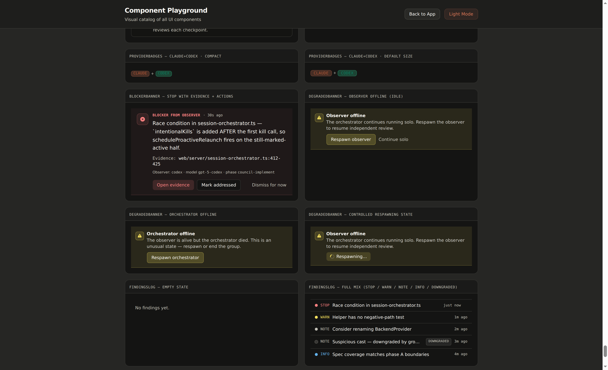

<p align="center">
  
</p>

<h1 align="center">Aura Companion</h1>
<p align="center"><strong>Self-learning web UI for Claude Code & Codex with Council Mode.</strong></p>
<p align="center">Paired orchestrator + observer sessions. Adaptive knowledge base. 29 skills that compound.</p>

<p align="center">
  <a href="LICENSE"></a>
  <a href="https://github.com/antonioshaman/aura-companion/stargazers"></a>
  = 1.0" />
  
</p>

---

**Aura Companion** is a self-learning web UI for Claude Code & Codex with **Council Mode** — paired orchestrator + observer sessions that catch what single-author thinking misses.

Council Mode pairs your main agent with an independent reviewer in one click. The orchestrator runs the work; the observer wakes on each phase checkpoint, reads only the just-changed surface, and pushes grounded findings back into your chat as a BlockerBanner you cannot miss. On top of that, an adaptive knowledge base accumulates patterns, gotchas, and decisions so every session is smarter than the last.

## What Makes It Different

```
┌──────────────────────────────────────────────────────────────┐
│  Council Mode             Paired orchestrator + observer     │
│  BlockerBanner + ObserverPanel + provider pairing           │
├──────────────────────────────────────────────────────────────┤
│  Carmack Council          Architecture + Review + Testing    │
│  6 skills: plan, review, implement, spec, test, self-improve│
├──────────────────────────────────────────────────────────────┤
│  Self-Learning            Adaptive Knowledge Base            │
│  5 skills: prime, learn, self-reflect, evolve, review-with-kb│
├──────────────────────────────────────────────────────────────┤
│  Design & UX              18 skills from impeccable          │
│  frontend-design, animate, audit, harden, polish, ...        │
└──────────────────────────────────────────────────────────────┘
```

**29 skills total + Council Mode.** Design for beautiful UIs. Council for rigorous engineering. Self-learning to get smarter every day. Council Mode to catch what one head misses.

## Council Mode (Orchestrator + Observer)

The multi-agent pattern that worked manually in past pipelines — catching ~2 P1 issues per phase that single-author review missed — is now reproducible in one click instead of two terminals.


```
You ↔ Orchestrator chat (left)                 Observer panel (right)
              │                                          ▲
              │ writes .council/checkpoints/<phase>.json │
              ▼                                          │
      .council/ filesystem ─────────────────────────────►│
                                                         │
              ◄──────── grounded STOPs as BlockerBanner ─┘
```

Toggle **Council Mode** on the New Session dialog and pick a pairing:

- **`claude+claude`** (default) — two Claude Code sessions sharing one workspace.
- **`claude+codex`** (experimental) — orchestrator on Claude, observer on Codex; cross-model independence at the cost of asymmetric tooling.

What you get in the UI:

- **`BlockerBanner`** in the chat slot — the most recent unresolved STOP, JSX-escaped, dismissible.
- **`ObserverPanel`** sibling of ChatView — status pill (`sleeping / spawning / reviewing / blocker-found / degraded / reconnecting`) plus a collapsible findings log.
- **`ProviderBadges`** in the sidebar — asymmetric chips when pairings are mixed-provider.
- **`Cmd/Ctrl+Shift+O`** toggles the Observer panel; **`Cmd/Ctrl+Shift+B`** focuses the BlockerBanner primary action.



Findings are grounded against the modified surface: STOPs that reference files outside the checkpoint's delta or missing from disk are downgraded to NOTE server-side. The browser dedupes by deterministic `fnd_<hex>` ids so restart-replay never doubles.

See [`docs/guides/council-mode.mdx`](docs/guides/council-mode.mdx) for the full guide and [`docs/reference/council-mode-architecture.mdx`](docs/reference/council-mode-architecture.mdx) for the wire protocol and state machine.

## Quick Start

```bash
# Clone
git clone https://github.com/antonioshaman/aura-companion.git
cd aura-companion

# Install & run
cd web && bun install && bun run dev
```

Open http://localhost:5174 in your browser.

**Requirements**: [Bun](https://bun.sh/) >= 1.0, Claude Code CLI or Codex CLI.

## Self-Learning

```
Session Start          During Work              Session End
     │                      │                        │
  /prime ──→ loads      /learn ──→ captures     /self-reflect ──→ extracts
  relevant   gotchas &   insights    on the      learnings from    the whole
  knowledge  patterns    instantly    fly         session           session
     │                      │                        │
     └──────────────────────┴────────────────────────┘
                            │
                    .agents/knowledge/
                    ├── patterns.jsonl
                    ├── gotchas.jsonl
                    ├── decisions.jsonl
                    ├── anti-patterns.jsonl
                    ├── codebase-facts.jsonl
                    └── api-behaviors.jsonl
```

Over time, `/evolve` promotes recurring patterns into `CLAUDE.md` rules and prunes stale entries. The system gets better the more you use it.

See [SELF-LEARNING.md](SELF-LEARNING.md) for the full guide.

## Architecture

```
Browser (React 19) ←→ WebSocket ←→ Hono Server (Bun) ←→ WebSocket (NDJSON) ←→ Claude Code CLI
     :5174              /ws/browser/:id        :3456        /ws/cli/:id         (--sdk-url)
```

- **Backend**: Hono on Bun (port 3456)
- **Frontend**: React 19 + Zustand + TailwindCSS (port 5174)
- **Monorepo**: `web/` (main app), `landing/`, `relay/`, `platform/`
- **Council Mode**: filesystem-protocol under `.council/` (checkpoints + reviews) — see [architecture reference](docs/reference/council-mode-architecture.mdx)
- **Testing**: Vitest with axe accessibility scans
- **State**: Session persistence to `$TMPDIR/vibe-sessions/` — survives restarts

## All 29 Skills

### Self-Learning (5 skills)

| Skill | Description |
|-------|------------|
| `/prime` | Load relevant knowledge before starting work. Auto-filters by branch and modified files |
| `/learn` | Quick-capture a learning mid-session without breaking flow |
| `/self-reflect` | End-of-session reflection — extracts learnings, prunes stale entries |
| `/evolve` | Meta-skill: promotes patterns to CLAUDE.md, prunes stale, finds knowledge gaps |
| `/review-with-kb` | Code review cross-referenced with accumulated knowledge base |

### Carmack Council (6 skills)

Based on John Carmack's engineering philosophy. A council of domain experts reviews your work.

| Skill | Description |
|-------|------------|
| `/council-plan` | Architect features with v1 domain experts before writing code |
| `/council-review` | Deep multi-perspective code review with v1 experts (security, refactoring, UX, backend, database, deploy, LLM, UI, testing) |
| `/council-implement` | Execute council plans task-by-task with per-task expert guidance |
| `/spec-writer` | Generate structured specs with Job Stories + Gherkin acceptance criteria |
| `/test-architect` | Audit test quality, detect AI shortcut patterns, specify tests before implementation |
| `/self-improvement` | Continuous learning: logs errors, corrections, and feature requests |

**Council experts include:** Troy Hunt (security), Martin Fowler (refactoring), Kent Beck (testing), Brandur Leach (databases), Simon Willison (LLM pipelines), Karri Saarinen (UI), Vitaly Friedman (UX), and specialized Telegram, Backend, and Deploy experts.

**v2 expert catalog in development.** A person-named v2 catalog (14 current experts → 22 with Phase 3β tension-pair expansion) is being built on the `feat/council-v2-pipeline` branch. v2 reseats the council on real-person surnames for LLM-dispatch reliability and adds ideological-tension pairs (Fowler ↔ Uncle Bob, Ritchie ↔ Torvalds, Beck ↔ Hickey, Hunt ↔ Willison, Majors ↔ Hashimoto) so synthesis becomes resolution rather than aggregation. **v1 remains production default** until atomic-swap promotion (Phase 6). See [Expert Catalog v2 Roadmap](docs/reference/expert-catalog-v2-roadmap.mdx) for the full list, status, and rationale; opt into v2 explicitly via `-v2` skill variants (`/council-plan-v2`, `/council-review-v2`, etc.).

### Design & UX (18 skills from [impeccable](https://github.com/pbakaus/impeccable))

| Skill | Description |
|-------|------------|
| `/frontend-design` | Production-grade UI with distinctive aesthetics |
| `/adapt` | Responsive design across screens and platforms |
| `/animate` | Purposeful animations and micro-interactions |
| `/audit` | Comprehensive quality audit (a11y, performance, theming) |
| `/bolder` | Amplify safe designs for visual impact |
| `/clarify` | Improve UX copy and error messages |
| `/colorize` | Add strategic color to monochromatic features |
| `/critique` | Design evaluation from UX perspective |
| `/delight` | Add moments of joy and personality |
| `/distill` | Strip designs to their essence |
| `/extract` | Consolidate reusable components and patterns |
| `/harden` | Better error handling, i18n, edge cases |
| `/normalize` | Align with design system consistency |
| `/onboard` | Improve onboarding flows and empty states |
| `/optimize` | Performance improvements (loading, rendering) |
| `/polish` | Final quality pass (alignment, spacing, details) |
| `/quieter` | Tone down overly bold designs |
| `/teach-impeccable` | One-time setup for persistent design guidelines |

## Recommended Workflow

### Feature Development with Council Mode

```
                          (toggle Council Mode on New Session)
/council-plan          # Plan with domain experts in orchestrator
/prime                 # Load relevant knowledge
                       # ... implement ...
                       # Observer wakes on each phase checkpoint,
                       # surfaces STOPs as BlockerBanner
/learn <insight>       # Capture learnings as you go
/review-with-kb        # Knowledge-informed review
/council-review        # Deep expert review
/self-reflect          # Capture session learnings
```

### Bug Fix

```
/prime <area>          # What do we know about this area?
                       # ... fix ...
/learn <gotcha>        # Why did this break?
/self-reflect          # Store for next time
```

### Monthly Maintenance

```
/evolve all            # Promote patterns, prune stale, find gaps
/test-architect audit  # Check test quality
```

## Knowledge Base Format

Each knowledge entry is a JSONL line:

```json
{
  "id": "pat-001",
  "type": "pattern",
  "fact": "WebSocket bridge must handle both NDJSON and JSON-RPC protocols",
  "recommendation": "Always test protocol changes against both backends",
  "confidence": "high",
  "provenance": [{"source": "codebase", "reference": "web/server/ws-bridge.ts"}],
  "tags": ["websocket", "protocol"],
  "affectedFiles": ["web/server/ws-bridge.ts"],
  "createdAt": "2026-04-24T00:00:00Z"
}
```

## Development

```bash
# Dev server (backend + frontend)
make dev

# Type check
cd web && bun run typecheck

# Run tests
cd web && bun run test

# Build for production
cd web && bun run build && bun run start
```

## File Structure

```
.agents/
├── knowledge/              # Self-learning knowledge base (JSONL)
│   ├── patterns.jsonl
│   ├── gotchas.jsonl
│   ├── decisions.jsonl
│   ├── anti-patterns.jsonl
│   ├── codebase-facts.jsonl
│   └── api-behaviors.jsonl
└── skills/                 # 29 agent skills
    ├── prime/              # Self-learning: load knowledge
    ├── learn/              # Self-learning: capture insight
    ├── self-reflect/       # Self-learning: session reflection
    ├── evolve/             # Self-learning: meta-improvement
    ├── review-with-kb/     # Self-learning: KB-informed review
    ├── council-plan/       # Carmack: architecture planning
    ├── council-review/     # Carmack: expert code review
    ├── council-implement/  # Carmack: guided implementation
    ├── spec-writer/        # Carmack: structured specs
    ├── test-architect/     # Carmack: test quality
    ├── self-improvement/   # Carmack: continuous learning
    ├── frontend-design/    # Design: UI creation
    └── ...                 # 16 more design skills
web/
├── server/                 # Hono + Bun backend (Council Mode pipeline)
│   ├── session-group-coordinator.ts
│   ├── group-state-machine.ts
│   ├── checkpoint-watcher.ts
│   ├── review-watcher.ts
│   ├── observer-prompt.ts
│   └── ...
└── src/                    # React 19 frontend
    ├── components/council/ # BlockerBanner, ObserverPanel, ProviderBadges, ...
    └── ...
.council/                   # Council Mode runtime artefacts (per workspace)
├── prompts/observer-system.md
├── checkpoints/<phase>.json
└── reviews/<phase>-<provider>-observer.md
```

## Contributing

1. Fork the repo
2. Create a feature branch (`git checkout -b feat/your-feature`)
3. Use commitizen format for commits
4. Run tests before pushing (`cd web && bun run typecheck && bun run test`)
5. Open a PR

The knowledge base (`.agents/knowledge/`) is project-specific — fork it and let it grow with your codebase.

## Attribution

Aura Companion is a fork of [`The-Vibe-Company/companion`](https://github.com/The-Vibe-Company/companion) by [The Vibe Company](https://thevibecompany.co) (MIT License) — the original web UI for Claude Code & Codex session bridging, published at [thecompanion.sh](https://thecompanion.sh). The Council Mode pairing system, the adaptive knowledge base, and the Carmack Council skill chain are Aura-specific extensions on top of that foundation. (Note: [nikolaiklein/Vibe-Companion](https://github.com/nikolaiklein/Vibe-Companion) is a separate sibling fork of the same upstream, not an ancestor of Aura.)

Other credits:
- [impeccable](https://github.com/pbakaus/impeccable) by Paul Bakaus — 18 design skills
- [Carmack Council](https://github.com/antonioshaman/carmack-council) — 6 engineering review skills
- Self-learning inspired by [metaswarm](https://github.com/dsifry/metaswarm) and [ChristopherA's seed prompt](https://gist.github.com/ChristopherA/fd2985551e765a86f4fbb24080263a2f)

## License

MIT
