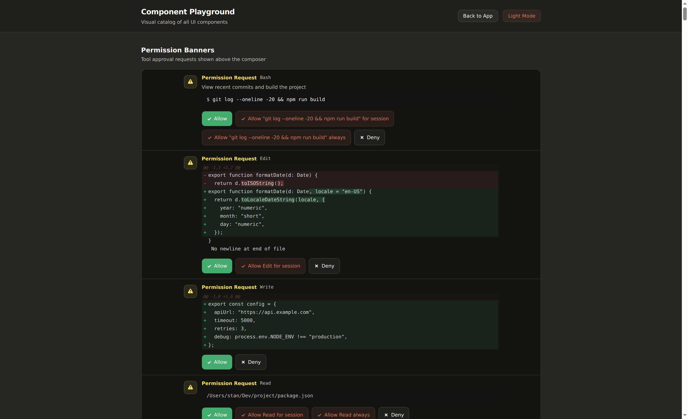

# Installation

## Requirements

- [Bun](https://bun.sh) runtime (>= 1.0)
- [Claude Code](https://docs.anthropic.com/en/docs/claude-code) CLI and/or [Codex](https://github.com/openai/codex) CLI
- Git

Install Bun and at least one agent CLI:

```bash
# Bun
curl -fsSL https://bun.sh/install | bash

# Claude Code
npm install -g @anthropic-ai/claude-code

# Codex (optional)
npm install -g @openai/codex
```

## Authenticate your agent CLI

### Claude Code

Run `claude` once and follow the auth prompt. Aura Companion uses whatever credentials the `claude` binary on your `PATH` already has.

### Codex — two auth modes

Codex supports two distinct auth modes — pick one before first run.

- **ChatGPT login (recommended if you have a Plus / Pro / Team subscription).** Usage counts against your subscription quota, **not** the per-token OpenAI API bill.

  ```bash
  codex login
  ```

  Follow the browser flow. Verify with:

  ```bash
  cat ~/.codex/auth.json | grep auth_mode  # → "auth_mode": "chatgpt"
  ```

- **API key.** Billed per token at OpenAI API rates. Set `OPENAI_API_KEY` in your environment before launching Aura Companion. Use this only if you don't have a ChatGPT subscription or want a separate billing line.

  ```bash
  export OPENAI_API_KEY=sk-...
  ```

If both are present, `auth.json` wins. To switch from API-key to ChatGPT mode after the fact, run `codex login` again — it overwrites `auth.json`.

## Run from source

The fastest way to use Aura Companion's Council Mode and self-learning skills is to clone the repo and run from source:

```bash
git clone https://github.com/antonioshaman/aura-companion.git
cd aura-companion/web
bun install
bun run dev
```

Open [http://localhost:5174](http://localhost:5174) — Vite dev server with HMR. The backend listens on `:3456`.

For a production-style build served from a single port:

```bash
cd aura-companion/web
bun install
bun run build
bun run start         # serves built UI on http://localhost:3456
```

<Tip>
The upstream npm package (`the-companion`) does **not** include Aura Companion's Council Mode, 29 skills, or self-learning system. Always use the `git clone` path above to get the full feature set.
</Tip>

## Remote access — Origin allowlist (REQUIRED for non-loopback)

Aura Companion gates `/ws/browser`, `/ws/terminal`, and `/ws/novnc` WebSocket upgrades behind an Origin allowlist. **Localhost** (`http://localhost:5173`, `http://localhost:5174`, same-host requests with no `Origin` header) is allowed unconditionally. **Any other origin** — public IP, LAN hostname, tailscale `*.ts.net`, reverse-proxy domain — must be listed in `COMPANION_ALLOWED_ORIGIN`.

If you reach the UI but every session reports `Connection timeout` after `Session started`, this is the cause: the browser WS upgrade is being rejected and the UI's generic banner doesn't say so.

Set the env var before launching the server, comma-separated for multiple origins:

```bash
# Single LAN host
export COMPANION_ALLOWED_ORIGIN="http://192.168.0.1:3456"

# Multiple origins (LAN + reverse-proxy domain)
export COMPANION_ALLOWED_ORIGIN="http://192.168.0.1:3456,https://companion.example.com"

bun run start
```

Origins are matched exactly — scheme + host + port, no trailing slash. `http://192.168.0.1:3456` does not match `https://192.168.0.1:3456` or `http://192.168.0.1`.

## Authentication token

The server auto-generates an auth token on first start, stored at `~/.companion/auth.json`.

```bash
# Show the current token
cd web && bun run generate-token

# Force-regenerate
cd web && bun run generate-token --force
```

Override via env var:

```bash
COMPANION_AUTH_TOKEN="my-secret-token" bun run start
```

## Run as a background service

For always-on access, register Aura Companion as a systemd unit (Linux) — see [Deploy on a Cloud VM](/deploy/cloud-vm) for a Tailscale-fronted GCP recipe, or [Deploy with systemd on a VPS](/deploy/vps-systemd) for a minimal public-IP setup.

## Your first session

### 1. Start the server

```bash
cd aura-companion/web && bun run dev
```

Open [http://localhost:5174](http://localhost:5174) (dev) or [http://localhost:3456](http://localhost:3456) (production build).

### 2. Create a session

Click **New Session** on the home page. Choose:

- **Backend**: Claude Code or Codex
- **Working directory**: The project folder the agent will operate in
- **Model** (Claude Code): Which Claude model to use
- **Branch** (optional): Select or create a git branch
- **Environment** (optional): Apply an [environment profile](/guides/docker-and-environments)
- **Council Mode** (optional): Toggle on for paired orchestrator + observer — see [Council Mode guide](/guides/council-mode)

Click **Start** to launch the session.

### 3. Chat with the agent

Type a prompt in the composer and press Enter. You'll see:

- **Streaming responses** as the agent thinks
- **Tool call blocks** showing each action (file reads, writes, bash commands)
- **Task items** extracted from the agent's work plan

### 4. Handle permissions

When the agent wants to write a file or run a command, a permission banner appears:



- **Allow**: Execute this tool call
- **Deny**: Skip this action
- **Allow all**: Auto-approve for the rest of the session

See [Permissions](/guides/sessions-and-permissions#permissions) for more control options.

## Next steps

- [Council Mode](/guides/council-mode) — paired orchestrator + observer sessions
- [Create saved prompts](/guides/saved-prompts) for reusable instructions
- [Build agents](/guides/agents) for automated workflows
- [Set up Docker environments](/guides/docker-and-environments) for isolated sessions
- [Connect Linear](/guides/linear-integration) for issue-driven development
